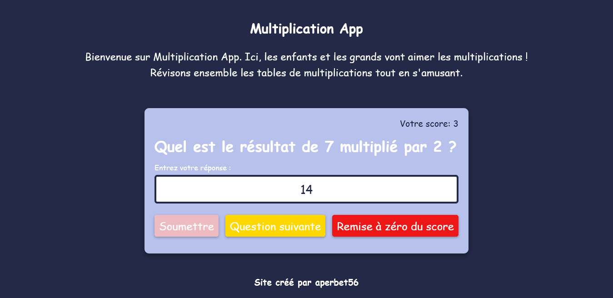

## MULTIPLICATION APP

## Le challenge

Création d'une application de multiplication qui va permettre de réviser les tables de multiplication tout en s'amusant. L'internaute répond à la question qui lui est posée. S'il donne la bonne réponse, son score s'incrémente et s'il donne une mauvaise réponse son score diminue. Pour afficher la question suivante, il suffit de cliquer sur le bouton "Question suivante". Enfin, l'utilisateur a la possiblité de remettre à zéro son score en cliquant sur le bouton "Remise à zéro".

## Démonstration

Lien vers le projet : https://aperbet56.github.io/multiplication_app/

## Développez avec

- Utilisation des balises sémantiques HTML5
- CSS3
- Flexbox
- Page web responsive
- Desktop first
- Utilisation d'un normaliseur : le fichier normalize.css
- JavaScript
- Code JavaScript commenté
- Local Storage
